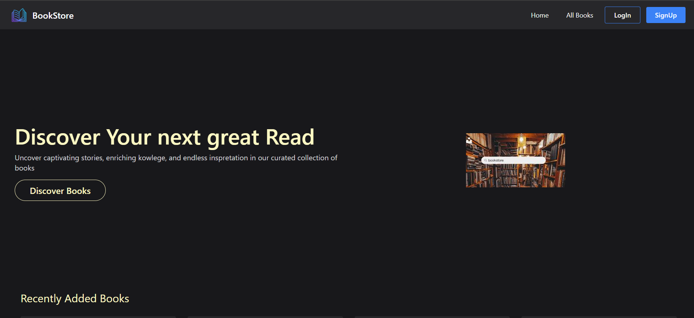
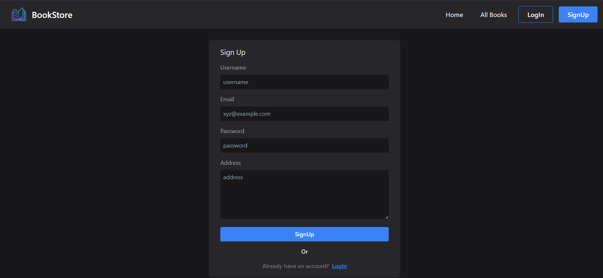
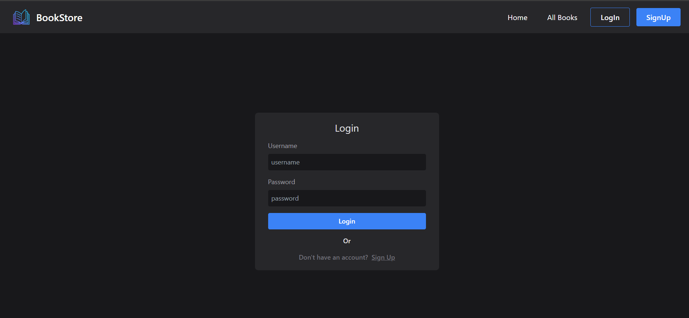
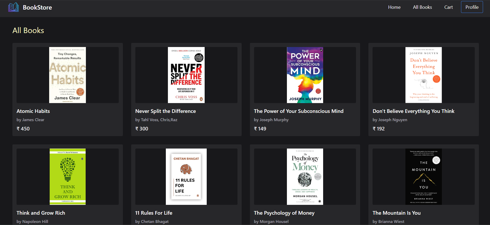
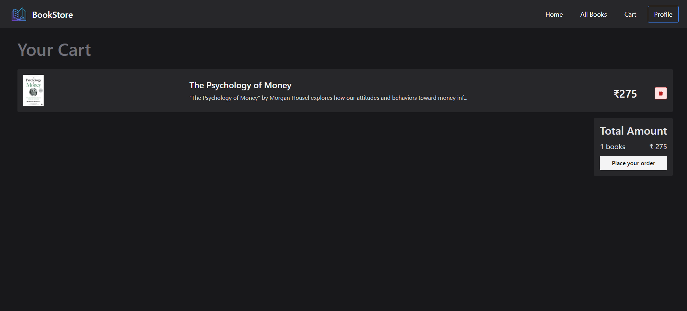
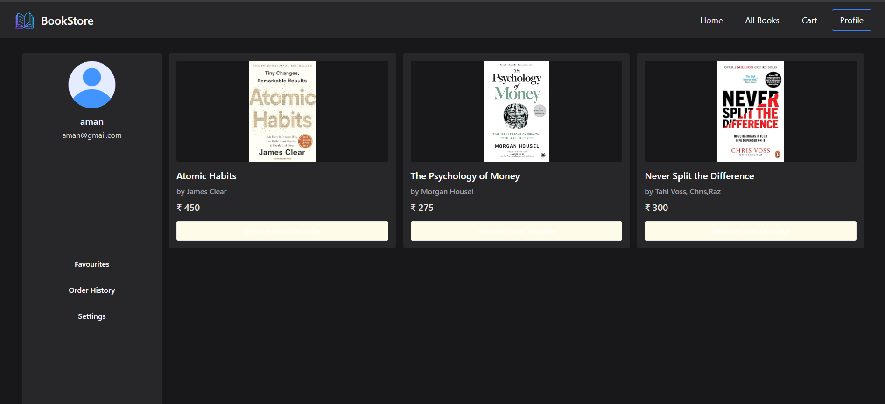
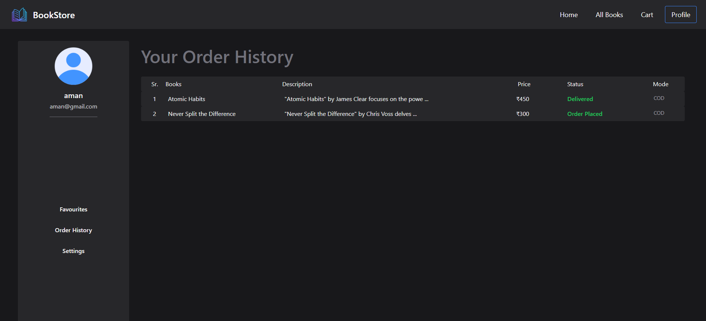
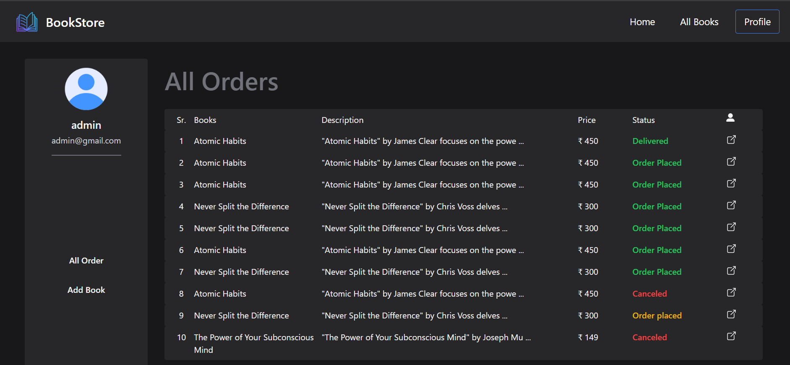
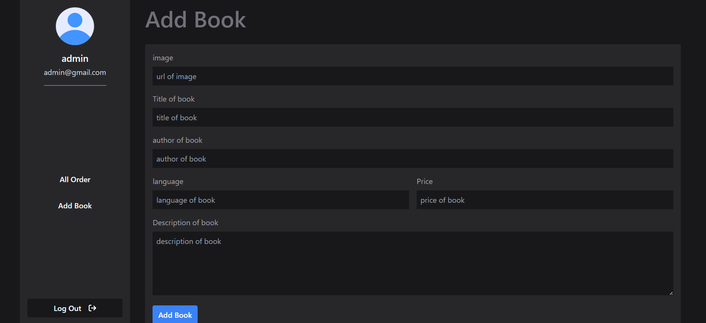

# MERN Online Bookstore

Welcome to the MERN Online Bookstore project! This application allows users to browse and purchase books, manage their profiles, and for administrators to add and update books. The project is built using MongoDB, Express.js, React, and Node.js.

## Table of Contents

- [Demonstration](#demonstration)
- [Features](#features)
- [Installation Guide](#installation-guide)
- [Environment Configuration](#environment-configuration)
- [Running the Application](#running-the-application)
- [Usage](#usage)

## Demonstration

### Screenshots


- **Home Page**: 
- **Signup**: 
- **login**: 
- **all-books**: 
- **Cart**: 
- **profile**: 
- **order-history**: 
- **admin-profile**: 
- **add-book**: 


## Features

- **User Management**: Sign up, log in, and manage user profiles.
- **Book Management**: View, add, update, and delete books (Admin).
- **Cart and Orders**: Add books to the cart, place orders, and view order history.
- **Profile Management**: View and update user settings, favorite books, and order history.
- **Responsive Design**: Optimized for various devices.

## Installation Guide

To get started with this project, follow these steps:

1. **Clone the Repository**

    ```bash
    git clone https://github.com/MeAniketPatel/Online-Bookstore.git
    ```

2. **Navigate to the Project Directory**

    ```bash
    cd Online-Bookstore
    ```

3. **Install Backend Dependencies**

    Navigate to the backend directory and install the required dependencies:

    ```bash
    cd backend
    npm install
    ```

4. **Install Frontend Dependencies**

    Navigate to the frontend directory and install the required dependencies:

    ```bash
    cd ..\frontend\
    npm install
    ```

## Environment Configuration

To configure the application, you need to set up environment variables. Create a `.env` file in the `backend`.

### Backend (.env)

Create a `.env` file in the `backend` directory with the following content:

```env
PORT=1000
URI=mongodb://localhost:27017/bookstore
```

- `PORT`: Port on which the server will run.
- `URI`: MongoDB connection URI. Paste your MongoDB URI.


## Running the Application

1. **Start the Backend Server**

    Navigate to the `backend` directory and run:

    ```bash
    nodemon .\app.js
    ```

2. **Start the Frontend Server**

    Navigate to the `frontend` directory and run:

    ```bash
    npm run dev
    ```

    This will open the application in your default browser at [http://localhost:5173](http://localhost:5173).

## Usage

- **Home Page**: View featured books and navigate to other sections.
- **All Books**: Browse all available books.
- **Cart**: Manage items in your shopping cart.
- **Profile**: View and manage your profile, favorites, order history, and settings.
- **Admin Features**: Add and update books (admin only).